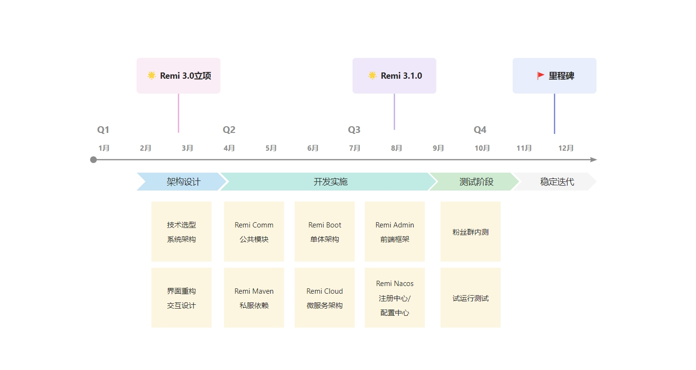

<h1 align="center" style="margin: 30px 0 30px; font-weight: bold;">Remi CMS</h1>
<h4 align="center">Remi CMS是基于瑞米快速开发平台（Remi Cloud）搭建的内容管理系统。</h4>

## 平台简介
Remi CMS是一种用于创建、管理和发布数字内容的应用程序框架。它允许用户在不需要深入的技术知识的情况下，有效地组织、修改和发布各种形式的内容，如文本、图片、视频等。Remi CMS适用于从个人博客到大型企业的官方网站，再到新闻门户、电子商务平台等多种类型的网站。无论是小型项目还是复杂的多站点部署，CMS都能提供灵活且强大的解决方案。 基于[Apache 2.0](https://www.apache.org/licenses/LICENSE-2.0)协议，毫无保留给个人及企业免费使用，由[江苏点九科技有限公司](https://dianjiu.cc)提供技术支持。

- 前端开发框架，请移步[Remi-Admin](https://gitee.com/remi-top/remi-admin)
- 后端开发框架，请移步[Remi-Cloud](https://gitee.com/remi-top/remi-cloud)

## 设计理念
在这里补充下设计师的设计理念：**所见即所得，极简且易用**。您的 **Star** 是对他们付出的最大肯定。

我相信大家在使用过程中能体验到设计师的用心之处，颜色的高对比度、左侧菜单的设计、减少了弹框的嵌套、三等分的抽屉使用等，让用户体验更加友好。   
瑞米平台目前还在公测阶段，可能会些许不足，也请您给些包容并及时反馈给我们，24年年底我们定会按时交出让您满意的瑞米快速开发平台。

## 项目规划

- 项目文档，请访问[语雀笔记](https://remi.yuque.com/r/organizations/homepage)
- [更新日志](https://remi.yuque.com/gvwcfc/dvpw89)
- [使用手册](https://remi.yuque.com/gvwcfc/vwwd5c)
- [操作视频](https://remi.yuque.com/gvwcfc/video) （正在抓紧更新，敬请期待）

## 体验地址

https://cms.remi.run （搭建中，敬请期待）

RemiAdmin/123456

### 模块说明
~~~
remi-cms    
├── docker                                         // 容器部署
├── docs                                           // 说明文档
│   └── drawio                                     // 流程图设计
│   └── pdman                                      // 数据库设计
│   └── sqls                                       // 数据库脚本
│   └── envs                                       // 多环境配置
├── remi-cms-api                                   // 服务间门面接口模块
├── remi-cms-app                                   // C端门面接口模块(H5、小程序、App) [3020]
├── remi-cms-uniapp                                // C端门面前端模块(H5、小程序、App) [3021]
├── remi-cms-domain                                // 领域实体模块，包含实体、值对象、聚合、事件等
├── remi-cms-infra                                 // 领域基础设施模块，包含持久化
├── remi-cms-job                                   // 分布式任务实现模块
├── remi-cms-server                                // 业务服务实现模块
├── remi-cms-web                                   // B端门户接口模块 [3010]
├── remi-cms-admin                                 // B端门户前端模块 [3011]
├── pom.xml                                        // 公共依赖

~~~

